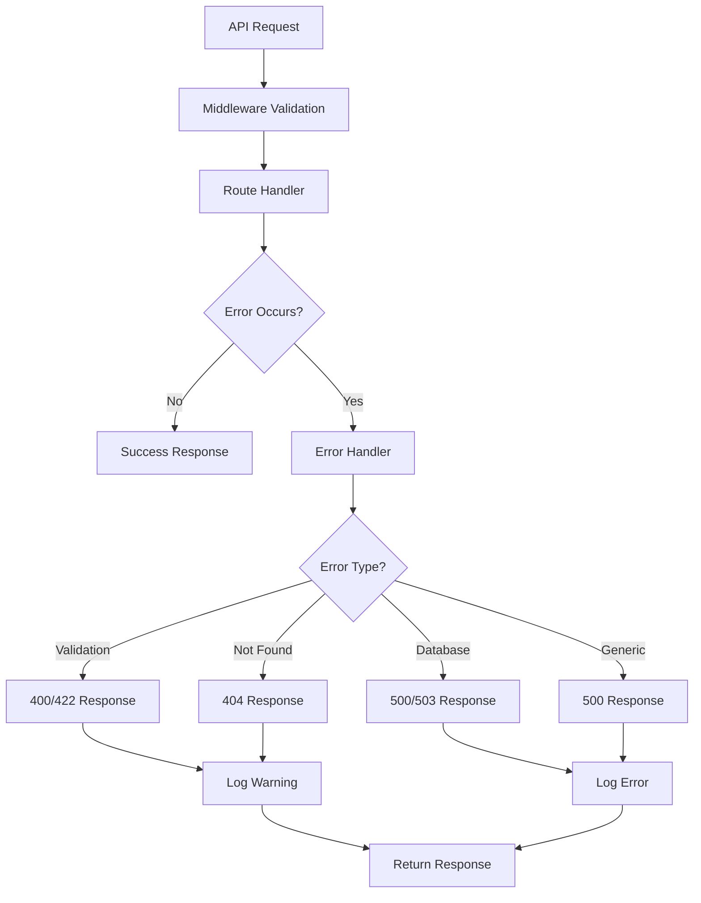

# Error Handling Documentation

## ERR-001: Comprehensive Error Handling Implementation

This document describes the implementation of comprehensive error handling across all NBA Stats API endpoints.

### Overview

The NBA Stats API now implements a centralized error handling system that provides:

- **Consistent error response formats**
- **Appropriate HTTP status codes**
- **Detailed error logging**
- **Security-conscious error messages**
- **Proper handling of different error types**

### Error Response Format

All API error responses follow this consistent structure:

```json
{
  "error": true,
  "status_code": 400,
  "message": "Validation failed",
  "timestamp": "2025-06-22T18:45:00",
  "details": {
    "field": "team_id",
    "validation_error": "Team ID must be between 1 and 1611661399"
  },
  "request_id": "req_123456789" // Optional
}
```

### Error Types and HTTP Status Codes

| Error Type | Status Code | Description |
|------------|-------------|-------------|
| Validation Error | 400 | Invalid input parameters or data format |
| Authentication Error | 401 | Missing or invalid authentication |
| Authorization Error | 403 | Insufficient permissions |
| Not Found Error | 404 | Requested resource does not exist |
| Validation Error (Complex) | 422 | Detailed validation failures |
| Rate Limit Exceeded | 429 | Too many requests |
| Internal Server Error | 500 | Unexpected server errors |
| Service Unavailable | 503 | External service or database unavailable |

### Implemented Error Handlers

#### 1. Validation Errors
- **Pydantic validation errors**: Detailed field-level validation with error codes
- **Custom validation**: NBA-specific ID format and range validation
- **Input sanitization**: XSS and injection prevention

#### 2. Database Errors
- **SQLAlchemy errors**: Connection issues, constraint violations
- **Transaction failures**: Rollback and error recovery
- **Query timeouts**: Graceful handling of slow queries

#### 3. Application Errors
- **Resource not found**: Teams, players, games
- **Business logic errors**: Invalid operations or state
- **External service failures**: NBA API unavailability

#### 4. Security Errors
- **Rate limiting**: Protection against abuse
- **Input validation**: SQL injection and XSS prevention
- **Authentication/Authorization**: Secure endpoint access

### Error Handling Flow



### Key Components

#### 1. Centralized Exception Handler (`app/core/exceptions.py`)
- **ErrorHandler class**: Routes errors to appropriate handlers
- **Custom exception types**: NBAStatsException, ValidationException, etc.
- **Global exception handler**: Catches all unhandled exceptions

#### 2. Router-Level Error Handling
- **Specific error types**: Database, validation, business logic
- **Consistent error raising**: Using centralized error handler
- **Appropriate logging**: Warning for client errors, error for server issues

#### 3. Middleware Integration
- **Validation middleware**: Input validation and sanitization
- **Rate limiting**: Protection against abuse
- **Request/Response logging**: Audit trail

### Testing

The error handling implementation includes comprehensive tests:

- **Validation error scenarios**: Invalid IDs, formats, ranges
- **Database error simulation**: Connection failures, constraints
- **404 error consistency**: All resource endpoints
- **Rate limiting**: Proper throttling behavior
- **Response format consistency**: Standardized error structure

### Security Considerations

- **Information disclosure**: No internal details in error messages
- **Error logging**: Full details logged server-side only
- **Rate limiting**: Prevent abuse and DoS attacks
- **Input validation**: Multiple layers of protection

### Performance Impact

- **Minimal overhead**: Error handlers only active during errors
- **Efficient logging**: Structured logging with appropriate levels
- **Database optimization**: Proper connection handling and timeouts

### Monitoring and Alerting

Error handling supports monitoring through:

- **Structured logging**: JSON format for log aggregation
- **Error metrics**: Count and classification of error types
- **Performance tracking**: Response times for error scenarios
- **Alert thresholds**: Critical error rate monitoring

### Configuration

Error handling behavior can be configured through:

- **Environment variables**: Log levels, error detail exposure
- **Database settings**: Connection timeouts, retry logic
- **Rate limiting**: Request limits per endpoint
- **Feature flags**: Error handler activation

### Examples

#### Validation Error
```bash
curl "http://localhost:7778/players/-1"
```
```json
{
  "detail": "Invalid NBA player ID: -1"
}
```

#### Not Found Error
```bash
curl "http://localhost:7778/teams/999999999"
```
```json
{
  "detail": "Team with identifier '999999999' not found"
}
```

#### Rate Limit Error
```json
{
  "error": "Rate limit exceeded",
  "detail": "Rate limit exceeded: 30 per 1 minute"
}
```

### Implementation Status

✅ **Completed:**
- Centralized error handling system
- Custom exception types
- Database error handling
- Validation error handling
- Global exception handler
- Comprehensive test suite
- Documentation

✅ **Tested Endpoints:**
- Teams: GET /teams, GET /teams/{id}
- Players: GET /players, GET /players/{id}
- Games: GET /games, GET /games/{id}
- Search: GET /search
- Admin: POST /admin/* (authentication pending)

### Next Steps

1. **Authentication errors**: Complete auth system implementation
2. **Performance monitoring**: Add metrics collection
3. **Error analytics**: Implement error tracking dashboard
4. **Documentation**: API documentation with error examples

### Maintenance

- **Regular testing**: Automated error scenario testing
- **Log monitoring**: Review error patterns and frequencies
- **Performance review**: Error handling overhead assessment
- **Documentation updates**: Keep error codes and examples current
